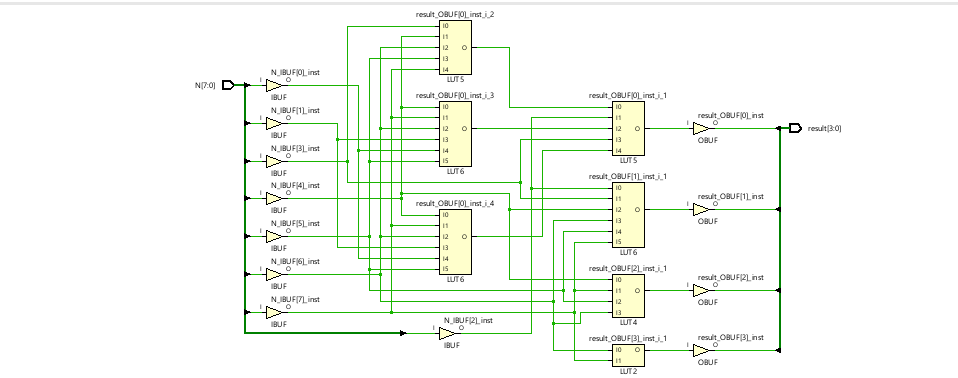
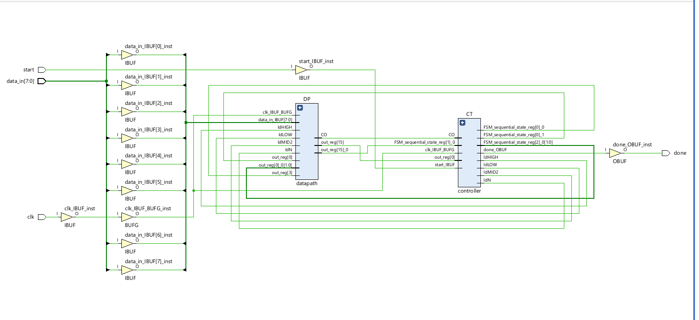
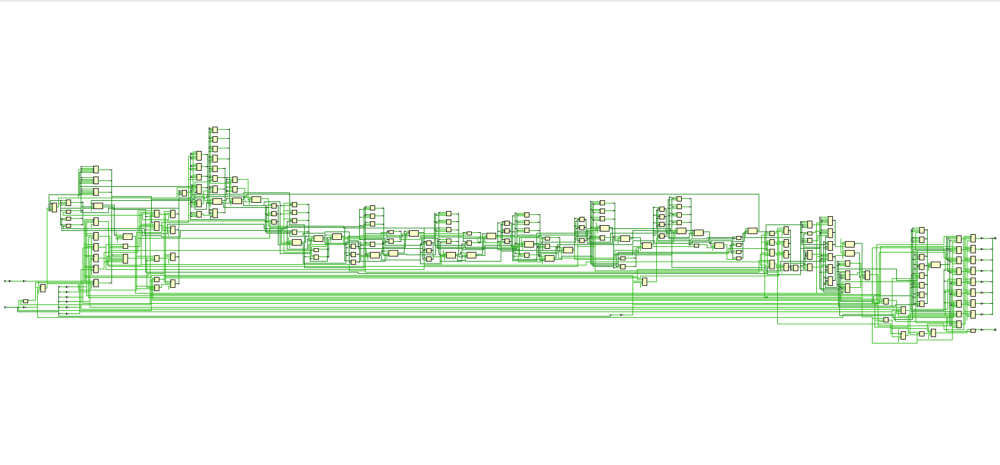
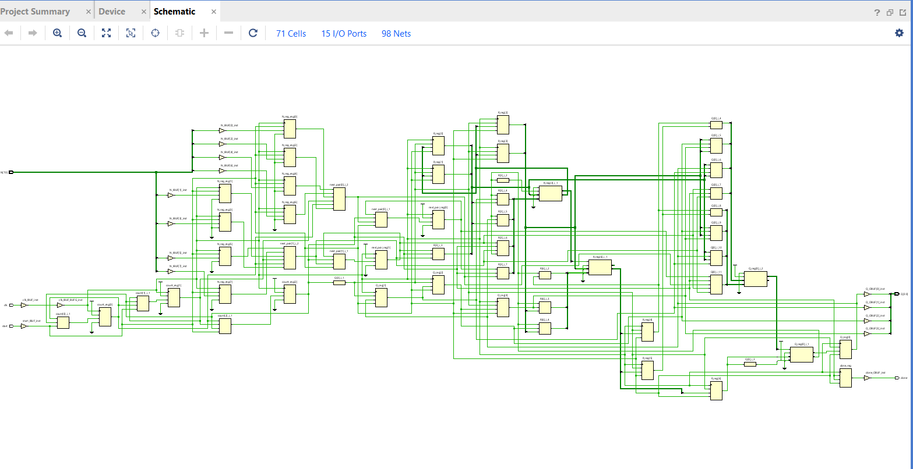

# Verilog Square Root Algorithms

This project implements, simulates, and synthesizes four different hardware 
architectures for computing the square root of an 8-bit unsigned integer 
using Verilog HDL, targeting the Xilinx Artix-7 FPGA.

Unlike typical simulation-only projects, all architectures were synthesized 
on the same FPGA target using AMD Vivado 2025.2, and compared using real 
hardware metrics — FPGA resource utilization (LUTs, Flip-Flops) and static 
timing analysis. This enables a meaningful architectural trade-off comparison 
grounded in actual hardware evidence rather than theoretical estimates.

---

## Implemented Algorithms

### 1. Binary Search Method
- Datapath + Controller based implementation
- Iteratively narrows the search range to find the square root
- Uses FSM-generated control signals to drive the datapath
- Demonstrates classical Controller-Datapath digital system design methodology

### 2. Lookup Table (LUT) Method
- Uses precomputed square-root values stored in a case statement
- Purely combinational implementation — no clock or FSM required
- Produces output in a single cycle
- Suitable only for small, fixed input ranges due to memory scaling

### 3. Newton-Raphson Method
- Iterative approximation using the update equation:
  **X_next = (X + N/X) / 2**
- FSM-based sequential architecture
- Fast convergence in 2–4 iterations
- Requires hardware division, which increases arithmetic complexity

### 4. Non-Restoring Square Root Method
- Digit-by-digit square root extraction, similar to non-restoring division
- Processes one pair of input bits per clock cycle
- Fixed 4 iterations for 8-bit input regardless of input value
- Widely used in arithmetic hardware due to efficiency

---

## Architecture

### Binary Search Method

Implemented using separate **Datapath** and **Controller** modules.

**Datapath Registers:**
- N (8-bit) — stores input
- LOW (8-bit) — lower bound of search
- HIGH (8-bit) — upper bound of search
- MID_SQUARE (16-bit) — stores square of midpoint

**Datapath also contains:**
- Combined (LOW + HIGH) / 2 and MID² computation block
- Comparator to compare MID² with N

**Controller FSM generates control signals:**
- ldN, ldLOW, ldHIGH
- low_sel, high_sel
- done

---

### Lookup Table (LUT) Method

Pure combinational implementation using a Verilog case statement.
No FSM or iterative hardware required.
Output is generated immediately for every input.

---

### Newton-Raphson Method

FSM-based iterative architecture.

**FSM States:**
1. Load Input
2. Initialize Estimate
3. Compute Next Approximation
4. Done

The algorithm repeatedly updates the estimate until convergence.

---

### Non-Restoring Square Root Method

Sequential iterative architecture.

**Main Registers:**
- Q — square root result
- R — partial remainder
- N_reg — input register
- Iteration Counter

One pair of input bits is processed per clock cycle.

---

## FPGA Implementation

All architectures were synthesized and implemented using:
- **Tool:** AMD Vivado Design Suite 2025.2
- **Target FPGA:** Xilinx Artix-7 (xc7a35tcpg236-1)

The following flow was performed for every architecture:

1. Behavioral Simulation (Icarus Verilog + GTKWave)
2. RTL Synthesis (Vivado)
3. Synthesized Schematic Inspection
4. FPGA Resource Utilization Analysis
5. Static Timing Analysis (clocked architectures only)

---

## Simulation Results

All four algorithms were verified using custom testbenches in Icarus Verilog
and waveforms were observed in GTKWave.

| Input N | Expected √N | Binary Search | LUT | Newton-Raphson | Non-Restoring |
|---------|-------------|---------------|-----|----------------|---------------|
| 16      | 4           | 4             | 4   | 4              | 4             |
| 50      | 7           | 7             | 7   | 7              | 7             |
| 144     | 12          | 12            | 12  | 12             | 12            |
| 169     | 13          | 13            | 13  | 13             | 13            |
| 255     | 15          | 15            | 15  | 15             | 15            |

For non-perfect square inputs, all algorithms correctly return the 
**floor of the square root** — the largest integer whose square does 
not exceed N.

---

## FPGA Synthesis Results

A 100 MHz timing constraint was applied to all sequential designs.
The LUT-Based design is purely combinational and contains no clock,
so timing analysis is not applicable for it.

| Algorithm | Slice LUTs | Flip-Flops | Timing Status |
|-----------|------------|------------|---------------|
| Binary Search | 104 | 42 | ✅ Meets 100 MHz |
| Newton-Raphson | 117 | 26 | ❌ Timing Violation |
| Non-Restoring | 19 | 25 | ✅ Meets 100 MHz |
| LUT-Based | 6 | 0 | N/A (Combinational) |

---

## Key Observations

**Non-Restoring** is the most hardware-efficient sequential design, using 
only 19 LUTs while comfortably meeting the 100 MHz timing constraint 
(WNS = +4.203 ns). It achieves this because it relies entirely on shifts, 
additions, and subtractions — no multiplication or division hardware required. 
The schematic confirms many registers but short combinational paths between 
them, which is why timing passes easily.

**Newton-Raphson** consumes the most resources (117 LUTs) and fails the 
100 MHz timing constraint because the hardware divider introduces a long 
combinational critical path. The synthesized schematic visually confirms 
this — a wide, dense chain of logic stretching horizontally representing 
the division operation that the signal must traverse within a single clock 
cycle. Newton-Raphson is better suited for software implementations or 
high-latency hardware pipelines.

**Binary Search** provides a balanced trade-off — moderate hardware usage 
(104 LUTs) with timing met. The higher flip-flop count (42) reflects the 
separate Datapath and Controller architecture with multiple dedicated 
registers. The schematic clearly shows the two distinct DP and CT blocks 
with control signals flowing between them, exactly matching the designed 
architecture.

**LUT-Based** uses the fewest LUTs (6) and produces output in a single 
cycle with no clock required. Vivado's synthesis engine automatically 
compressed the entire 256-entry case statement into just 6 LUTs using 
boolean logic optimization, rather than using actual memory or ROM. 
Timing analysis is not applicable as the design contains no sequential 
elements.

---

## Synthesized Schematics

### LUT-Based

Vivado compressed the entire 256-entry case statement into 6 LUTs using 
boolean optimization. Input bits enter through IBUFs, pass through LUT 
logic, and exit through OBUFs — no registers or clock required.

---

### Binary Search

The schematic clearly shows two distinct blocks — DP (Datapath) and CT 
(Controller) — with control signals flowing between them, exactly matching 
the designed Controller-Datapath architecture.

---

### Newton-Raphson

The wide, dense horizontal chain of logic visually explains why timing 
fails — the hardware divider creates a long combinational critical path 
that cannot be traversed within a single 10 ns clock cycle at 100 MHz.

---

### Non-Restoring

Despite appearing complex, the schematic shows many registers with short 
combinational paths between them — the key reason timing passes 
comfortably. No division or multiplication hardware is present.

---

## Algorithm Comparison

| Algorithm | Latency | LUTs | Flip-Flops | Timing | Scalability |
|-----------|---------|------|------------|--------|-------------|
| LUT | 1 cycle (combinational) | 6 | 0 | N/A | Poor |
| Non-Restoring | Fixed 4 cycles | 19 | 25 | ✅ Meets 100 MHz | Excellent |
| Binary Search | 4–5 iterations | 104 | 42 | ✅ Meets 100 MHz | Good |
| Newton-Raphson | 2–4 iterations | 117 | 26 | ❌ Violation | Excellent |

---

## Design Trade-Offs

### LUT
**Advantages**
- Fastest output — single combinational cycle
- Simplest implementation
- Lowest LUT usage (6 LUTs)

**Disadvantages**
- Memory requirement grows exponentially with input width
- Not scalable beyond small input ranges

### Binary Search
**Advantages**
- Easy to understand and implement
- Clearly demonstrates Controller-Datapath design methodology
- Meets 100 MHz timing constraint

**Disadvantages**
- Highest flip-flop usage among all four designs (42 FFs)
- Execution time varies with input value

### Newton-Raphson
**Advantages**
- Fast convergence in 2–4 iterations
- Scales well for larger input sizes

**Disadvantages**
- Requires hardware division — creates long critical path
- Fails 100 MHz timing constraint on Artix-7
- Highest LUT usage among all four designs (117 LUTs)

### Non-Restoring
**Advantages**
- Most hardware-efficient sequential implementation (19 LUTs)
- Fixed execution time regardless of input value
- Comfortably meets 100 MHz timing constraint (WNS = +4.203 ns)
- Widely used standard in arithmetic hardware

**Disadvantages**
- More complex to understand initially compared to Binary Search
- Requires careful partial remainder management

---

## Repository Structure
Verilog_Square_Root_Algorithms

│

├── BINARY SEARCH

│   ├── datapath.v

│   ├── controller.v

│   ├── testbench.v

│   ├── top_module.v

│   ├── BINARY SEARCH.png         (simulation waveform)

│   └── schematic_binary.png      (synthesized schematic)

│

├── LOOKUP TABLE

│   ├── sr_lut.v

│   ├── sr_lut_tb.v

│   ├── LOOKUP TABLE.png          (simulation waveform)

│   └── schematic_lut.png         (synthesized schematic)

│

├── NEWTON RAPHSON

│   ├── newton_raphson.v

│   ├── newton_raphson_tb.v

│   ├── NEWTON RAPHSON.png        (simulation waveform)

│   └── schematic_newton.png      (synthesized schematic)

│

├── NON RESTORING

│   ├── non_restoring.v

│   ├── non_restoring_tb.v

│   ├── NON RESTORING.png         (simulation waveform)

│   └── schematic_nonrestoring.png (synthesized schematic)

│

└── README.md

---

## Tools Used

- Verilog HDL
- AMD Vivado Design Suite 2025.2
- Target FPGA: Xilinx Artix-7 (xc7a35tcpg236-1)
- Icarus Verilog (Behavioral Simulation)
- GTKWave (Waveform Analysis)
- Visual Studio Code
